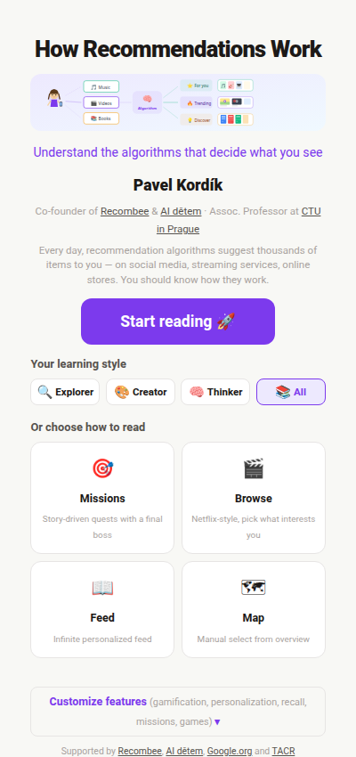

# p-book: Personalized Interactive Books

**p-book** is an open-source standard for creating personalized, interactive digital books powered by recommendation engines. This repository contains the first p-book: **"How Recommendations Work"** — an interactive book about recommendation systems for ages 8-15.

> **Version 1.0** — This is the first public release. The project will continue to evolve based on user feedback and research studying the effects of individual features on learning quality and reader well-being.

## Live Demo

**[recsysbook-kids.vercel.app](https://recsysbook-kids.vercel.app)**



## What is a p-book?

A p-book is a book that adapts to the reader. Instead of a fixed linear text, content is organized as independent blocks that can be served through multiple reading modes, personalized by a recommendation engine, and enriched with interactive elements.

### Reading Modes

| Mode | Description |
|------|-------------|
| **Missions** | Story-driven quests with guided steps and a final boss quiz |
| **Browse** | Netflix-style shelves — pick what interests you |
| **Read** | Chapter-by-chapter with infinite scroll |
| **Map** | Visual overview — see everything, pick your path |
| **Tutor** | AI assistant that answers questions about the content |

### Features (all optional, can be toggled on/off)

- **Gamification** — XP, levels, badges, completion certificate
- **Spaced repetition** — Anki-style recall quizzes for long-term retention
- **Personalization** — Recombee-powered recommendations, voice-based content paths
- **Mini-games** — 8 interactive click-based games with auto-hide timer
- **Missions** — 6 story-driven learning paths with branching and boss quizzes
- **Knowledge cloud** — Visual word cloud of concepts you've learned
- **Analytics** — Per-interaction mode tracking for research

## Content Structure

Content is organized as markdown files with YAML frontmatter:

```
content/
  book.json              # Chapter index
  ch1-what-are-recommendations/
    01-spine-have-you-noticed.md
    02-spine-recommendations-everywhere.md
    01c-game-signal-sort.md
    05-question-what-type.md
    ...
games/
  signal-sort.json       # Game data definitions
  taste-match.json
  ...
images/
  kids-footprints.svg    # SVG diagrams
  ...
```

### Content File Format

```yaml
---
id: ch1-noticed
type: spine              # spine | question | game
title: "Have You Ever Noticed?"
readingTime: 2
teaser: "YouTube somehow knows you love Minecraft videos. But how?"
voice: universal         # universal | explorer | creator | thinker
core: true               # Required for certificate
status: accepted         # draft | review | accepted
---

Your markdown content here...
```

### Content Types

| Type | Description |
|------|-------------|
| `spine` | Regular content section (reading material) |
| `question` | Interactive quiz with multiple choice options |
| `game` | Mini-game with data from `games/*.json` |

### Game Format

Small JSON files in `games/` directory:

```json
{
  "type": "sort",
  "title": "Signal Sort",
  "instruction": "Is this a strong or weak signal?",
  "buckets": ["Strong signal", "Weak signal"],
  "items": [
    { "text": "Watched a video to the end", "answer": 0 },
    { "text": "Skipped after 2 seconds", "answer": 1 }
  ]
}
```

Game types: `sort` (classify), `match` (find twin), `pop` (click to collect), `order` (sequence).

## For LLMs and Bots

p-book is designed to be easily indexed and co-authored by AI:

- **`/.well-known/pbook.json`** — Discovery manifest for bots
- **`/pbook.json`** — Full project manifest with schema docs
- **`/content/book.json`** — Structured chapter/file index
- **Content files** — Plain markdown with machine-readable YAML frontmatter
- **Status field** — `draft → review → accepted` workflow for AI-contributed content

LLMs can read, index, and contribute to p-books using standard file operations. See [CONTRIBUTING.md](CONTRIBUTING.md) for the content format and PR workflow.

## Create Your Own p-book

1. **Fork this repository**
2. **Edit `content/book.json`** — define your chapters
3. **Write content** in `content/chN-*/` as markdown files with frontmatter
4. **Customize `js/config.js`** — title, author, voices, features
5. **Deploy** to Vercel or Netlify (or any static host)

### Without Recombee (works out of the box)

The book works fully without Recombee — all recommendation features have local fallbacks (random/sequential content). Set `recombee.enabled: false` in config.js or simply don't configure a token.

### With Recombee (personalized recommendations)

1. Create a free database at [recombee.com](https://recombee.com)
2. Set `RECOMBEE_TOKEN` environment variable
3. Create scenarios in Recombee admin: `homepage-personal`, `homepage-voice`, `next-read`, `context-related`, `search`

## Local Development

```bash
# Create .env with your Recombee token (optional)
echo "RECOMBEE_TOKEN=your_token_here" > .env

# Start dev server (static files + Recombee proxy)
node serve-local.js

# Or with shell script
sh serve.sh

# Open http://localhost:8000
```

The dev server includes a Recombee API proxy at `/.netlify/functions/recombee`, so everything works locally including recommendations.

### Content Validation

```bash
node .github/scripts/validate-content.js
```

Validates all content files: frontmatter schema, unique IDs, book.json consistency, game references.

## Deployment

### Vercel

1. Import repo on [vercel.com](https://vercel.com)
2. Set env var: `RECOMBEE_TOKEN`
3. Deploy — no build step needed

### Netlify

1. Connect repo on [netlify.com](https://netlify.com)
2. Set env var: `RECOMBEE_TOKEN`
3. Deploy — functions auto-detected from `netlify/functions/`

### Any Static Host

Works as a static site without Recombee. Just serve the root directory.

## Architecture

```
index.html          # Reader app (single page)
admin.html          # Admin dashboard
js/
  app.js            # Main application (~3000 lines)
  config.js         # Configuration and feature flags
  recombee.js       # Recombee client + UserModel + gamification
  tutor.js          # AI tutor engine (mock, ready for LLM)
  markdown.js       # Markdown→HTML renderer with math/table support
  diagrams.js       # SVG diagram renderer
css/style.css       # All styles
content/            # Markdown content files
games/              # Game data (JSON)
images/             # SVG diagrams
netlify/functions/  # Serverless proxy (Netlify)
api/                # Serverless proxy (Vercel)
```

## Future Integrations

### Tiny Learning Platform
Integration with [Tiny School](https://www.tiny.school) for:
- Argumentative and critic chatbots during reading
- Progress reporting to teacher/parent profiles
- Cross-platform learning analytics

### LLM Author Persona
The tutor system (`js/tutor.js`) is built with a `TutorEngine` abstraction ready for LLM integration:
- `MockTutorEngine` — current keyword-search implementation
- `LLMTutorEngine` — future drop-in replacement via serverless function → Claude/GPT API
- Author escalation — "Message the real author" with conversation queue

### Research Analytics
Every interaction logs the discovery mode (`netflix`, `read`, `mission`, `map`, `search`, `tutor`), enabling research comparing:
- Personalized vs. non-personalized content delivery
- Mission-based vs. free-browse learning
- Effects of gamification on engagement and retention
- Impact of spaced repetition on knowledge retention

## Contributing

See [CONTRIBUTING.md](CONTRIBUTING.md) for content format, style guide, and PR workflow.

## License

Content: [CC BY-NC-SA 4.0](https://creativecommons.org/licenses/by-nc-sa/4.0/)
Code: [MIT](LICENSE)

## Authors

- **Pavel Kordík** — Author, co-founder of [Recombee](https://recombee.com) & [AI dětem](https://aidetem.cz), assoc. professor at [CTU in Prague](https://kam.fit.cvut.cz)
- AI-assisted development with Claude (Anthropic)
