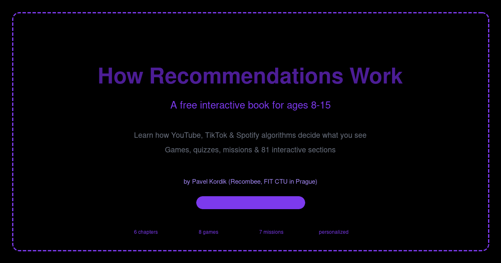

# How Recommendations Work — a self-recommending living book

**A book about recommender systems that personalizes itself with one — and lets its readers extend it.**

**Live: [recsys-pbook.vercel.app](https://recsys-pbook.vercel.app)** · RecSys '26 demo · CC BY-NC-SA 4.0

**▶ [Narrated 3-minute demo walkthrough](media/pbook-demo-commented.mp4)** — serving, telling, catalog co-creation, and the loop closing on the reader's own signals.



A recommendation platform normally decides three things for you: **how** content is served, **how** each piece is told, and **what** exists in the catalog at all. This book inverts all three:

1. **Serving** — the reader picks the consumption paradigm (story missions, carousels, an algorithmic feed, a map) and can switch anytime. The initial paradigm is randomized; every switch is logged, so the deployment doubles as a research instrument.
2. **Telling** — every concept can be told many ways: another example world, deeper or gentler, more visual, as a story or a comic, in another language. The reader steers each section; the catalog answers first, and a missing telling is an honestly reported gap — never a silent near-match.
3. **Catalog** — on a real gap, readers generate a new telling (contract-constrained, validated) or remix any passage, diagram, or animation. Shared creations climb a curation ladder — private → community → edited → core — with full provenance; **editorship itself is earned** through adopted contributions. Readers can even propose whole missing concepts, which are then shown to others as *proposed, not written yet* cards — demand is measured before anyone writes.

Because a book teaching recommender systems is personalized *by* one, readers watch the mechanisms they are reading about act on their own behavior.

## The content model

Content separates *what must be learned* from *how it is told*:

- A **concept** is a unit of understanding with a human-owned **contract**: learning objective, must-cover points, one canonical recall question + answer, forbidden claims. Contracts live in [`content/concepts.json`](content/concepts.json).
- A **telling** is one presentation of a concept, tagged on the facet taxonomy below. A telling declares the **subspace** it covers — ranges `a..b` on ordered dimensions, sets `a|b` on categorical ones (and on the concept axis: one telling may serve several concepts).

| Dimension | What it captures | Values (subset shown) |
|---|---|---|
| lens | the world all examples come from | generic · e-commerce · media · social feeds · education · job boards |
| depth | assumed reader background | intro · standard · technical · research |
| visuality | how much visuals carry the point | text-first · balanced · visual-first |
| formalism | amount of math | none · light · full |
| length | reading commitment | tl;dr · standard · deep |
| genre | structural form | explainer · story · worked example · code walkthrough · comic · animation |
| language | natural language | English · Czech |
| carriers | building blocks present (derived from content) | prose · table · diagram · image · animation · formula · code |
| trust state | provenance rung; controls serving, labels, certification | private → community → edited → core |

The recommender ([Recombee](https://www.recombee.com)) receives facets as item properties and learns per-reader facet affinities; the reader sees and can override that profile (open learner model). Generation is **segment-scoped** — written for everyone who shares the requested facets, never addressed to an individual — and passes a mechanical gate (contract coverage, formalism/length lints, honest visuality) before display. The certificate reads **human-verified core content only**: co-creation grows the catalog without lowering the certified bar.

## Roles

**Readers steer · contributors share · editors verify · the arbiter decides.**

- **Readers** — onboard in two taps, optionally state a learning goal (the book composes a 🎯 personal mission from matching concepts), steer any section, vote on proposed concepts, earn XP.
- **Contributors** — flag issues, share their generated/remixed tellings, or author tellings as PRs. Every profile has an invite link (`?invite=R-…`).
- **Editors** — run the demand-driven redaction from [`/admin`](https://recsys-pbook.vercel.app/admin): 📥 Demand → 🌱 Proposals → ⚡ Community → 🩺 Health → 📚 Catalog → 📈 Reach → ✍️ Studio. Editorship is **earned** (an adopted telling promotes you) or **invited** (`?invite=E-…` links, generated in Reach).

Full guides: **[HUMANS.md](HUMANS.md)** (readers / contributors / editors) · **[AGENTS.md](AGENTS.md)** (binding rules for AI collaborators — the facet metadata is AI-maintained under the governance split *humans own the facts, AI maintains the metadata*) · **[PERSONALIZATION.md](PERSONALIZATION.md)** (implementation reference) · `_design-collective-pbook.md` (design rationale) · `_editorial.md` (log of record).

## Repository layout

```
content/            chapters as markdown blocks with YAML frontmatter (facets included)
content/book.json   reading order (satellites follow their concept's anchor)
content/concepts.json        concept index + contracts (generated — never hand-edit)
content/concept-proposals.json  concepts under interest testing (ghost items)
api/                Vercel serverless: generate (variants·remix·svg-remix·propose-concepts),
                    boss (AI examiner), recombee (signing proxy), log (Supabase), sync-recombee
js/, css/, index.html   the reader app (no build step, offline-capable PWA)
admin.html          the editorial console
scripts/migrate-facets.js       concept grouping + derived facets (idempotent)
.github/scripts/validate-content.js   CI validation (schema, subspaces, links, honesty lints)
```

## Run it locally

```bash
git clone https://github.com/kordikp/recsys-pbook && cd recsys-pbook
node serve-local.js 8777          # static + /api shims, no dependencies
# open http://localhost:8777
```

Optional env (put in `.env` or export): `OPENAI_API_KEY` or `ANTHROPIC_API_KEY` enables generation + the examiner locally; `RECOMBEE_DB`/`RECOMBEE_TOKEN` enable live recommendations (local fallbacks cover everything else). Useful flags: `?seed=demo` fills a plausible reading history (screenshots, booth demos); `#view-<name>` deep-links a view; `#c/<concept-slug>` links a concept.

After editing content:

```bash
node scripts/migrate-facets.js            # regroup concepts, derive carriers
node .github/scripts/validate-content.js  # must pass before committing
```

## Deploy your own

The repo is Vercel-ready (no build step; `vercel.json` maps legacy function paths). Environment variables:

| Variable | Purpose |
|---|---|
| `RECOMBEE_DB`, `RECOMBEE_TOKEN` | recommendations + community layer (private token, server-side only) |
| `ANTHROPIC_API_KEY` *(preferred)* or `OPENAI_API_KEY`+`OPENAI_MODEL` | generation, remix, AI examiner, concept drafting |
| `SUPABASE_URL`, `SUPABASE_KEY` | interaction log (`interactions` table) powering the admin |
| `SYNC_SECRET` | protects `/api/sync-recombee` |

First run: `/admin` → 📚 Catalog → **Sync Items** (pushes blocks + facet properties to Recombee). Then invite editors from 📈 Reach and fill the gaps that matter — editors go first, demand does the rest.

To create a **different book** on the same engine, replace `content/` (see the frontmatter format in [`pbook.json`](pbook.json) and the authoring rules in AGENTS.md/HUMANS.md); everything else — steering, generation, curation, admin — is content-agnostic.

## Contributing

Three paths, lightest first: **flag** an issue in the app (🚩) · **share** a telling you generated or remixed (like it → consent → community layer; editors adopt the best) · **author** content as a PR — serve an existing concept's contract, declare facets honestly (AGENTS.md has the operational tests), register in `book.json`, and make the validator pass. Notable contributions can earn you editor status.

## Research

The deployment is an open instrument: paradigm switches, steering, honest misses, generation, ghost votes, and shares are logged (anonymized) for studying interface-level personalization, LLM content quality under contracts, and the economics of elastic catalogs. A RecSys '26 demo paper describes the system; analytics are visible in `/admin` → 📈 Reach.

## License & credits

Content and code: **CC BY-NC-SA 4.0**. Created by [Pavel Kordík](https://www.recombee.com) (Recombee, CTU Prague) with Eva Nečasová (AI dětem) and the Recombee team. Supported by Recombee, [AI dětem](https://aidetem.cz), Google.org and TAČR.
